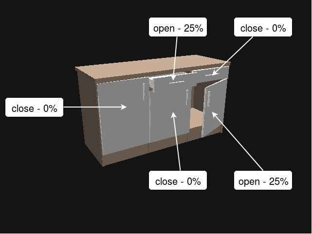

# ED submodel_states
This repository extends the updating capabilities of [ed_sensor_integration](https://github.com/tue-robotics/ed_sensor_integration) with a submodel capable update and additional state recognition.

## Getting started
``` shell
# Get dependencies for ed (see: https://github.com/tue-robotics/ed#Installation)
sudo apt-get install ros-kinetic-geometry-msgs ros-kinetic-pcl-ros ros-kinetic-message-filters ros-kinetic-image-geometry ros-kinetic-kdl-parser ros-kinetic-roslib ros-kinetic-std-srvs libyaml-cpp-dev ros-kinetic-cv-bridge ros-kinetic-tf libassimp-dev ros-kinetic-message-generation ros-kinetic-roscpp ros-kinetic-message-runtime ros-kinetic-class-loader


# Move to catkin workspace
roscd; cd ../src;

# Fetch dependencies
git clone https://github.com/iki-wgt/ed.git
cd ed; git checkout submodel_states; cd ..
git clone https://github.com/tue-robotics/ed_object_models.git
git clone https://github.com/tue-robotics/ed_msgs.git
git clone https://github.com/tue-robotics/code_profiler.git
git clone https://github.com/tue-robotics/geolib2.git
git clone https://github.com/tue-robotics/rgbd.git
git clone https://github.com/tue-robotics/tue_config.git
git clone https://github.com/tue-robotics/tue_filesystem.git
git clone https://github.com/tue-robotics/tue_serialization.git
git clone https://github.com/iki-wgt/ed_sensor_integration.git
cd ed_sensor_integration; git checkout submodel_states; cd ..

# Move to catkin and start build
roscd; cd ..; catkin_make
```

## External dependencies
- [ed (Branch submodel_states)](https://github.com/iki-wgt/ed/tree/submodel_states)
- [ed_sensor_integration (Branch submodel_states)](https://github.com/iki-wgt/ed_sensor_integration/tree/submodel_states)
- [ed_object_models](https://github.com/tue-robotics/ed_object_models.git)  
- [ed_msgs](https://github.com/tue-robotics/ed_msgs.git)  
- [code_profiler](https://github.com/tue-robotics/code_profiler.git)  
- [geolib2](https://github.com/tue-robotics/geolib2.git)  
- [rgbd](https://github.com/tue-robotics/rgbd.git)  
- [tue_config](https://github.com/tue-robotics/tue_config.git)  
- [tue_filesystem](https://github.com/tue-robotics/tue_filesystem.git)  
- [tue_serialization](https://github.com/tue-robotics/tue_serialization.git)  

## Build dependencies
 - No Dockerfile

## Run dependencies
 - Working ED_Config.yaml [(see ed tutorial)](https://github.com/tue-robotics/ed_tutorials)
 - Working ED_Model.yaml [(see ed tutorial)](https://github.com/tue-robotics/ed_tutorials)

## Additional services

For additional informations about the non default ED parameters see [ED submodel_states](https://github.com/iki-wgt/ed/tree/submodel_states).


 - /ed/kinect/state_update
   - Description:
     - State update is based on /ed/kinect/update. If no additional parameters are defined in the model, state_update behaves like update. Due to the implementation of the default update service, the service can not update models which include submodels that overlap each other from the birds eye view. The state_update is capable of these updates if some additional parameters are defined.
   - Parameters:
     - area_description (string): Id of the entity that should be updated.
     - update_mode (string): 'main', 'dependents', 'specific' (default)
      - main: Updates the main object of the state-update-group.
      - dependents: Updates all non main objects of the state-update-group.
      - specific: Updates only the object with the id specified in "area_description".
     - background_padding (float): Default parameter see [ED](https://github.com/tue-robotics/ed)

 - /ed/kinect/get_state
   - Description:
     - Should be called only if the state of the entity in question, was updated beforehand. Returns an interpolated value between the closed and open state, defined in the yaml parameter "state_definitions". This value represents the openness coefficient of the entity. Additionally a boolean "open"/"close" will be returned based on a 20% threshold. States above 100% and below 0% are possible.
   - Parameters:
     - id (string): Id of the entity in question. This entity must have the parameter 'state_definitions'.



## Authors
 - Jakob Fichtl - _Main Contributor_ - @jf-171197
 - Michael Zappe - _Contributor_ - @mz-171742

## License
 - To be determined.
